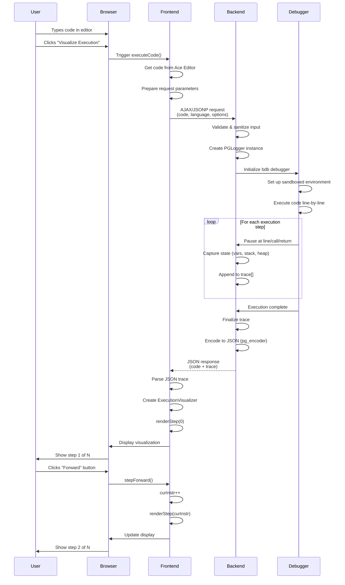

# Architecture Diagrams - Online Python Tutor

This document provides visual representations of the Online Python Tutor architecture using ASCII diagrams and Mermaid syntax.

## Table of Contents
1. [System Overview](#system-overview)
2. [Data Flow Sequence](#data-flow-sequence)
3. [Component Architecture](#component-architecture)
4. [Trace Format Structure](#trace-format-structure)
5. [VSCode Extension Architecture](#vscode-extension-architecture)
6. [Deployment Architecture](#deployment-architecture)

---

## System Overview

### Three-Tier Architecture

```
┌────────────────────────────────────────────────────────────────────┐
│                         USER INTERFACE                             │
│  ┌──────────────────────────────────────────────────────────────┐  │
│  │                      Web Browser                              │  │
│  │  ┌────────────┐  ┌────────────┐  ┌───────────────────────┐  │  │
│  │  │ Ace Editor │  │   Navbar   │  │  Visualization Panel  │  │  │
│  │  │ (Code)     │  │ (Controls) │  │  (Stack/Heap/Output)  │  │  │
│  │  └────────────┘  └────────────┘  └───────────────────────┘  │  │
│  └──────────────────────────────────────────────────────────────┘  │
└────────────────────────────────────────────────────────────────────┘
                                │
                                │ HTTP/JSONP
                                ▼
┌────────────────────────────────────────────────────────────────────┐
│                       FRONTEND LAYER                               │
│  ┌──────────────────────────────────────────────────────────────┐  │
│  │              TypeScript/JavaScript Code                       │  │
│  │  ┌──────────────┐  ┌────────────┐  ┌──────────────────────┐  │  │
│  │  │ opt-frontend │  │  pytutor   │  │  opt-frontend-common │  │  │
│  │  │  (UI Logic)  │  │ (Viz Core) │  │     (Utilities)      │  │  │
│  │  └──────────────┘  └────────────┘  └──────────────────────┘  │  │
│  │                                                                │  │
│  │  Libraries: jQuery, D3.js, jsPlumb, jQuery UI                 │  │
│  └──────────────────────────────────────────────────────────────┘  │
└────────────────────────────────────────────────────────────────────┘
                                │
                                │ AJAX Request
                                │ (code + options)
                                ▼
┌────────────────────────────────────────────────────────────────────┐
│                       BACKEND LAYER                                │
│  ┌──────────────────────────────────────────────────────────────┐  │
│  │                   Bottle Web Server                           │  │
│  │  ┌──────────────┐  ┌────────────┐  ┌──────────────────────┐  │  │
│  │  │  pg_logger   │  │ pg_encoder │  │     web_exec_*       │  │  │
│  │  │  (Tracer)    │  │  (JSON)    │  │  (Lang Wrappers)     │  │  │
│  │  └──────────────┘  └────────────┘  └──────────────────────┘  │  │
│  │           │                │                    │             │  │
│  │           └────────────────┴────────────────────┘             │  │
│  │                            │                                  │  │
│  │                            ▼                                  │  │
│  │                    ┌───────────────┐                          │  │
│  │                    │  bdb (Python  │                          │  │
│  │                    │   Debugger)   │                          │  │
│  │                    └───────────────┘                          │  │
│  └──────────────────────────────────────────────────────────────┘  │
└────────────────────────────────────────────────────────────────────┘
                                │
                                │ JSON Response
                                │ (execution trace)
                                ▼
┌────────────────────────────────────────────────────────────────────┐
│                   NON-PYTHON BACKENDS (v4-cokapi)                  │
│  ┌──────────────────────────────────────────────────────────────┐  │
│  │                     Node.js Server                            │  │
│  │  ┌────────────┐  ┌────────────┐  ┌────────────┐            │  │
│  │  │  C/C++     │  │    Java    │  │ JavaScript │  ... etc   │  │
│  │  │  (Docker)  │  │  (Docker)  │  │  (Docker)  │            │  │
│  │  └────────────┘  └────────────┘  └────────────┘            │  │
│  └──────────────────────────────────────────────────────────────┘  │
└────────────────────────────────────────────────────────────────────┘
```

---

## Data Flow Sequence

### Complete Request-Response Cycle



---

## Component Architecture

### Frontend Component Hierarchy

```
ExecutionVisualizer (pytutor.ts)
├── Code Display
│   ├── Ace Editor Integration
│   ├── Line Highlighting
│   └── Syntax Highlighting
│
├── Frames & Variables
│   ├── Global Variables Renderer
│   │   ├── Variable List
│   │   └── Value Display (primitive/reference)
│   │
│   └── Stack Frames Renderer
│       ├── Frame Header (function name)
│       ├── Local Variables
│       └── Return Value Display
│
├── Heap Objects
│   ├── Object Factory
│   │   ├── List Renderer
│   │   ├── Dict Renderer
│   │   ├── Instance Renderer
│   │   ├── Function Renderer
│   │   └── Custom Type Renderers
│   │
│   └── Object Layout Manager
│       ├── Positioning
│       └── Size Calculation
│
├── Connection Manager (jsPlumb)
│   ├── Arrow Drawing
│   ├── Connection Endpoints
│   └── Hover Effects
│
└── Navigation Controls
    ├── Step Forward/Back
    ├── Slider
    └── Jump to Step
```

### Backend Processing Pipeline

```
User Code (string)
     │
     ▼
┌─────────────────┐
│  bottle_server  │
│   (HTTP layer)  │
└─────────────────┘
     │
     ▼
┌─────────────────┐
│   web_exec_*    │
│ (Lang routing)  │
└─────────────────┘
     │
     ▼
┌─────────────────┐
│   pg_logger     │
│   (Tracer)      │
└─────────────────┘
     │
     ├── 1. Create PGLogger(bdb.Bdb)
     ├── 2. _runscript(code)
     │      │
     │      ├── Set up sandbox
     │      ├── Redirect stdout
     │      └── Run code with bdb
     │
     ├── 3. For each step:
     │      │
     │      ├── user_line()    ────┐
     │      ├── user_call()    ────┤
     │      ├── user_return()  ────┼──> interaction()
     │      └── user_exception()───┘         │
     │                                       │
     │                                       ├── Get frame info
     │                                       ├── Capture variables
     │                                       ├── Build trace_entry
     │                                       └── trace.append()
     │
     └── 4. finalize()
            │
            ▼
┌─────────────────┐
│  pg_encoder     │
│  (JSON encoder) │
└─────────────────┘
     │
     ├── Encode primitives inline
     ├── Create heap for objects
     ├── Generate REF pointers
     └── Build final JSON
     │
     ▼
┌─────────────────┐
│  JSON Response  │
│  { code, trace }│
└─────────────────┘
```

---

## Trace Format Structure

### Execution Trace JSON Schema

```
┌─────────────────────────────────────────────────────────────┐
│                    Execution Trace                          │
│  {                                                          │
│    "code": "x = 5\ny = 10\nz = x + y",                     │
│    "trace": [ <array of execution points> ]                │
│  }                                                          │
└─────────────────────────────────────────────────────────────┘
                      │
                      ├── trace[0] (Initial state)
                      ├── trace[1] (After line 1)
                      ├── trace[2] (After line 2)
                      └── trace[N] (Final state)
                      
                      
Each trace[i] is an Execution Point:
┌────────────────────────────────────────────────────────────────┐
│                     Execution Point                            │
│  {                                                             │
│    "line": 2,                    // Line about to execute     │
│    "event": "step_line",         // Event type                │
│    "func_name": "<module>",      // Current function          │
│                                                                │
│    "globals": {                  // Global variables           │
│      "x": 5,                     //   Primitive (inline)      │
│      "lst": ["REF", 1]           //   Reference (heap)        │
│    },                                                          │
│    "ordered_globals": ["x", "lst"],  // Display order        │
│                                                                │
│    "stack_to_render": [          // Stack frames              │
│      {                                                         │
│        "frame_id": 1,                                          │
│        "func_name": "foo",                                     │
│        "encoded_locals": { "a": 1, "b": 2 },                 │
│        "ordered_varnames": ["a", "b"],                        │
│        "is_highlighted": true,                                │
│        "unique_hash": "foo_f1"                                │
│      }                                                         │
│    ],                                                          │
│                                                                │
│    "heap": {                     // Heap objects              │
│      "1": ["LIST", 1, 2, 3],                                  │
│      "2": ["DICT", ["a", 1], ["b", 2]],                      │
│      "3": ["INSTANCE", "MyClass", ...]                        │
│    },                                                          │
│                                                                │
│    "stdout": "Hello\nWorld\n"    // Cumulative output        │
│  }                                                             │
└────────────────────────────────────────────────────────────────┘
```

### Reference Graph Example

```
┌─────────────────────────────────────────────────────────┐
│                      GLOBALS                            │
│                                                         │
│  x = 5                    (primitive, inline)          │
│  lst = ["REF", 1] ─────────────────┐                   │
│  obj = ["REF", 3] ───────────┐     │                   │
└──────────────────────────────┼─────┼───────────────────┘
                               │     │
                               │     │
┌──────────────────────────────┼─────┼───────────────────┐
│                      HEAP    │     │                   │
│                              ▼     ▼                   │
│  "1": ["LIST", 10, 20, ["REF", 2]]                     │
│                            │                           │
│                            └──────┐                    │
│                                   ▼                    │
│  "2": ["LIST", "a", "b"]                               │
│                                                         │
│  "3": ["INSTANCE", "MyClass",                          │
│         [["attr1", 100],                               │
│          ["attr2", ["REF", 1]]]] ───────┐              │
│                                         │              │
│                         (circular ref)  │              │
│                                         └──────────────┘
└─────────────────────────────────────────────────────────┘
```

---

## VSCode Extension Architecture

### Extension Components

```
┌───────────────────────────────────────────────────────────────┐
│               VSCode Extension Host Process                   │
├───────────────────────────────────────────────────────────────┤
│                                                               │
│  ┌─────────────────────────────────────────────────────────┐ │
│  │         Extension Activation (extension.ts)             │ │
│  └─────────────────────────────────────────────────────────┘ │
│                         │                                     │
│                         ├── Register Commands                │
│                         ├── Register Debug Adapter           │
│                         └── Register Webview Provider        │
│                                                               │
│  ┌──────────────────┐  ┌──────────────────┐  ┌────────────┐ │
│  │  Command Handler │  │  Debug Adapter   │  │  Webview   │ │
│  │  ─────────────── │  │  ────────────    │  │  Panel     │ │
│  │                  │  │                  │  │  ─────     │ │
│  │ visualize()      │  │ PythonTutor      │  │            │ │
│  │    │             │  │ DebugSession     │  │ HTML/CSS   │ │
│  │    └──────┬──────│  │                  │  │ JavaScript │ │
│  │           │      │  │ implements:      │  │            │ │
│  │           │      │  │ - launchRequest  │  │ (ported    │ │
│  │           │      │  │ - nextRequest    │  │  pytutor   │ │
│  │           │      │  │ - stackTrace     │  │  code)     │ │
│  │           │      │  │ - scopes         │  │            │ │
│  └───────────┼──────┘  └──────────────────┘  └────────────┘ │
│              │                  │                    ▲        │
└──────────────┼──────────────────┼────────────────────┼────────┘
               │                  │                    │
               │                  │  State Updates     │
               │                  └────────────────────┘
               │
               ▼
┌──────────────────────────────────────────────────────────────┐
│                  VSCode Debug Protocol (DAP)                 │
└──────────────────────────────────────────────────────────────┘
               │
               ▼
┌──────────────────────────────────────────────────────────────┐
│              Language Debug Adapter (e.g., Python)           │
└──────────────────────────────────────────────────────────────┘
               │
               ▼
┌──────────────────────────────────────────────────────────────┐
│                    User's Program                            │
│                  (Python/JavaScript/etc.)                    │
└──────────────────────────────────────────────────────────────┘
```

### Debug Session Flow

```
User Action          Extension              Debug Adapter         Debugger
    │                    │                         │                 │
    │ Click "Visualize"  │                         │                 │
    ├───────────────────>│                         │                 │
    │                    │ startDebugging()        │                 │
    │                    ├────────────────────────>│                 │
    │                    │                         │ launch()        │
    │                    │                         ├────────────────>│
    │                    │                         │                 │
    │                    │                         │ <initialized>   │
    │                    │                         │<────────────────┤
    │                    │                         │                 │
    │                    │ configurationDone       │                 │
    │                    ├────────────────────────>│ continue()      │
    │                    │                         ├────────────────>│
    │                    │                         │                 │
    │                    │                         │ <stopped>       │
    │                    │                         │<────────────────┤
    │                    │ onDidStop               │                 │
    │                    │<────────────────────────┤                 │
    │                    │                         │                 │
    │                    │ stackTrace()            │                 │
    │                    ├────────────────────────>│ getStack()      │
    │                    │                         ├────────────────>│
    │                    │                         │ <stack>         │
    │                    │ <stack frames>          │<────────────────┤
    │                    │<────────────────────────┤                 │
    │                    │                         │                 │
    │                    │ scopes()                │                 │
    │                    ├────────────────────────>│ getLocals()     │
    │                    │                         ├────────────────>│
    │                    │ <variables>             │ <vars>          │
    │                    │<────────────────────────┤<────────────────┤
    │                    │                         │                 │
    │                    │ Build trace entry       │                 │
    │                    │ Send to webview         │                 │
    │                    │                         │                 │
    │ <display update>   │                         │                 │
    │<───────────────────┤                         │                 │
    │                    │                         │                 │
    │ Click "Forward"    │                         │                 │
    ├───────────────────>│                         │                 │
    │                    │ next()                  │                 │
    │                    ├────────────────────────>│ stepOver()      │
    │                    │                         ├────────────────>│
    │                    │                         │                 │
    │                    │ ... (repeat) ...        │                 │
```

### Webview Communication

```
┌─────────────────────────────────────────────────────────┐
│                 Extension Process                       │
│  ┌────────────────────────────────────────────────────┐ │
│  │           Extension Code                           │ │
│  │                                                    │ │
│  │  vscode.window.createWebviewPanel()               │ │
│  │       │                                           │ │
│  │       │ webview.postMessage({                     │ │
│  │       │   command: 'updateState',                 │ │
│  │       │   trace: traceEntry                       │ │
│  │       │ })                                        │ │
│  │       │                                           │ │
│  │       ▼                                           │ │
│  └───────┼────────────────────────────────────────────┘ │
│          │                                              │
│          │ Message Passing (postMessage API)           │
│          │                                              │
│  ┌───────▼────────────────────────────────────────────┐ │
│  │           Webview Process (Isolated)               │ │
│  │                                                    │ │
│  │  window.addEventListener('message', event => {    │ │
│  │    if (event.data.command === 'updateState') {   │ │
│  │      visualizer.renderStep(event.data.trace);    │ │
│  │    }                                             │ │
│  │  });                                             │ │
│  │                                                    │ │
│  │  // Send message back to extension               │ │
│  │  vscode.postMessage({                            │ │
│  │    command: 'step',                              │ │
│  │    direction: 'forward'                          │ │
│  │  });                                             │ │
│  │                                                    │ │
│  │  ┌──────────────────────────────────────────┐    │ │
│  │  │  HTML/CSS/JS (Visualization)             │    │ │
│  │  │  - Stack frame rendering                 │    │ │
│  │  │  - Heap object rendering                 │    │ │
│  │  │  - Arrow drawing (jsPlumb or Canvas)     │    │ │
│  │  └──────────────────────────────────────────┘    │ │
│  └───────────────────────────────────────────────────┘ │
└─────────────────────────────────────────────────────────┘
```

---

## Deployment Architecture

### Current Heroku Deployment

```
┌────────────────────────────────────────────────────────┐
│                    Heroku Platform                     │
├────────────────────────────────────────────────────────┤
│                                                        │
│  ┌──────────────────────────────────────────────────┐ │
│  │              Heroku Router                       │ │
│  │         (Load Balancer / SSL)                    │ │
│  └──────────────────────────────────────────────────┘ │
│                       │                                │
│                       ▼                                │
│  ┌──────────────────────────────────────────────────┐ │
│  │              Web Dyno (Container)                │ │
│  │  ┌────────────────────────────────────────────┐ │ │
│  │  │      Gunicorn WSGI Server                  │ │ │
│  │  │  ┌──────────────────────────────────────┐ │ │ │
│  │  │  │   Bottle Application                 │ │ │ │
│  │  │  │   - Static file serving              │ │ │ │
│  │  │  │   - Python backend routes            │ │ │ │
│  │  │  │   - JSONP endpoints                  │ │ │ │
│  │  │  └──────────────────────────────────────┘ │ │ │
│  │  └────────────────────────────────────────────┘ │ │
│  └──────────────────────────────────────────────────┘ │
│                                                        │
│  Configuration:                                        │
│  - Procfile: web: gunicorn ...                        │
│  - runtime.txt: python-3.x                            │
│  - requirements.txt: bottle, gunicorn                 │
└────────────────────────────────────────────────────────┘

External Non-Python Backends (v4-cokapi):
┌────────────────────────────────────────────────────────┐
│              Separate Server (Linode)                  │
│  ┌──────────────────────────────────────────────────┐ │
│  │         Node.js Server (cokapi.js)               │ │
│  │  ┌────────────────────────────────────────────┐ │ │
│  │  │         Docker Containers                  │ │ │
│  │  │  ┌──────────┐  ┌──────────┐  ┌─────────┐ │ │ │
│  │  │  │  C/C++   │  │   Java   │  │   JS    │ │ │ │
│  │  │  │ Backend  │  │  Backend │  │ Backend │ │ │ │
│  │  │  └──────────┘  └──────────┘  └─────────┘ │ │ │
│  │  └────────────────────────────────────────────┘ │ │
│  └──────────────────────────────────────────────────┘ │
└────────────────────────────────────────────────────────┘
```

### Modern Deployment Architecture (Proposed)

```
┌──────────────────────────────────────────────────────────────┐
│                    CDN (CloudFlare)                          │
│         (Static assets, caching, DDoS protection)            │
└──────────────────────────────────────────────────────────────┘
                           │
                           ├── /static/* ──> CDN cache
                           │
                           ▼
┌──────────────────────────────────────────────────────────────┐
│              Frontend (Vercel / Netlify)                     │
│  - Static HTML/CSS/JS                                        │
│  - React/Vue SPA (optional)                                  │
│  - Server-side rendering                                     │
└──────────────────────────────────────────────────────────────┘
                           │
                           │ API calls
                           ▼
┌──────────────────────────────────────────────────────────────┐
│         API Gateway (AWS API Gateway / Kong)                 │
│  - Rate limiting                                             │
│  - Authentication                                            │
│  - Request routing                                           │
└──────────────────────────────────────────────────────────────┘
                           │
                ┌──────────┴──────────┐
                │                     │
                ▼                     ▼
┌────────────────────────┐  ┌────────────────────────┐
│  Python Backend        │  │ Multi-Lang Backends    │
│  (AWS Lambda /         │  │ (Cloud Run / ECS)      │
│   Google Cloud Run)    │  │                        │
│                        │  │  ┌──────────────────┐  │
│  - Serverless          │  │  │  Java Backend    │  │
│  - Auto-scaling        │  │  └──────────────────┘  │
│  - Pay-per-use         │  │  ┌──────────────────┐  │
└────────────────────────┘  │  │  C/C++ Backend   │  │
                            │  └──────────────────┘  │
                            │  ┌──────────────────┐  │
                            │  │  JS Backend      │  │
                            │  └──────────────────┘  │
                            └────────────────────────┘
                                      │
                    ┌─────────────────┴─────────────────┐
                    │    Container Orchestration        │
                    │    (Kubernetes / Cloud Run)       │
                    └───────────────────────────────────┘
```

### Request Flow Comparison

**Current (Monolithic):**
```
Browser → Heroku → Python Backend → Response
        ↓
        → External Server → Docker (C/Java/etc.) → Response
```

**Proposed (Microservices):**
```
Browser → CDN → Frontend (Vercel)
             ↓
             → API Gateway → Python (Cloud Run)
                          → Java (Cloud Run)
                          → C/C++ (Cloud Run)
                          → Cache (Redis)
```

---

## Summary

These diagrams illustrate the key architectural patterns in Online Python Tutor:

1. **Separation of Concerns**: Clear boundaries between frontend (visualization) and backend (execution)
2. **Trace-Based Architecture**: Complete execution state captured in JSON, enabling client-side stepping
3. **Extensible Design**: Easy to add new language backends or frontend features
4. **VSCode Integration**: Feasible through Debug Adapter Protocol and Webview API

For more details, see [TECHNICAL_DOCUMENTATION.md](TECHNICAL_DOCUMENTATION.md).

---

**Document Version**: 1.0  
**Last Updated**: October 2025  
**Format**: ASCII + Mermaid diagrams
